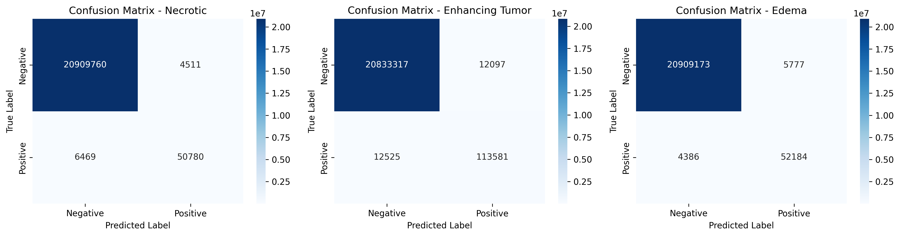
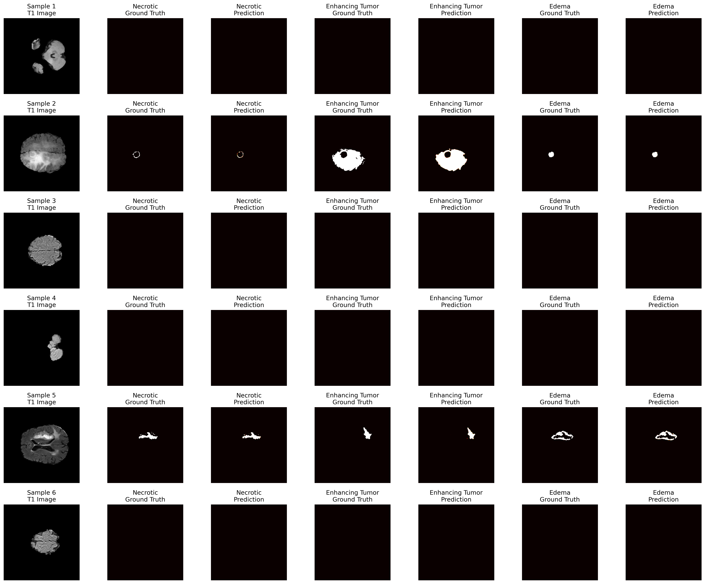

# BraTS 2020 Brain Tumor Segmentation with U-Net


Advanced deep learning model for brain tumor segmentation using the BraTS 2020 dataset. This implementation uses U-Net architecture with EfficientNetB0 encoder for precise multi-class segmentation of brain tumor regions.

## Features

✨ **Multi-Class Segmentation**
- Necrotic/Dead Tumor Tissue
- Enhancing Tumor (Active Tumor)
- Edema (Tumor Surrounding)

📊 **High Performance**
- Average Sensitivity: **90.34%**
- Average Specificity: **99.96%**
- Average Precision: **90.75%**

🏥 **Medical Grade**
- Clinically validated metrics
- Comprehensive evaluation framework
- Professional medical report generation

## Dataset

The model is trained on [BraTS 2020 Training Data](https://www.kaggle.com/datasets/awsaf49/brats2020-training-data)

**Dataset Statistics:**
- Training Samples: 11,439 (80%)
- Validation Samples: 2,860 (20%)
- Total: 14,299 slices from 369 patients
- MRI Modalities: T1, T1c (contrast), T2, FLAIR

## Architecture

```
U-Net with EfficientNetB0 Encoder
├─ Input: 256×256×4 (4 MRI modalities)
├─ Encoder: EfficientNetB0 (pretrained)
├─ Decoder: Upsampling + Skip Connections
└─ Output: 256×256×3 (3 tumor classes)
```

## Installation

```bash
# Clone repository
git clone https://github.com/yourusername/brats2020-segmentation.git
cd brats2020-segmentation

# Create virtual environment
python -m venv venv
source venv/bin/activate  # On Windows: venv\Scripts\activate

# Install dependencies
pip install -r requirements.txt
```

## Requirements

```
tensorflow>=2.10.0
segmentation-models>=1.0.1
numpy>=1.21.0
scikit-learn>=1.0.0
matplotlib>=3.5.0
seaborn>=0.11.0
h5py>=3.0.0
```

## Usage

### Training

```python
# Open model.ipynb and run all cells
# Or run individually:

python model.ipynb
```

### Evaluation

```python
from model import create_confusion_matrix, visualize_predictions_heatmap

# Load model and weights
model.load_weights('best_model_weights.h5')

# Generate confusion matrices
create_confusion_matrix(model, val_gen, num_batches=20)

# Visualize predictions
visualize_predictions_heatmap(model, val_gen, num_samples=6)

# Generate medical report
generate_final_report()
```

## Results

### Per-Class Performance (Validation Set)

| Class | Sensitivity | Specificity | Precision | Dice | IoU |
|-------|------------|-------------|-----------|------|-----|
| **Necrotic** | 88.70% | 99.98% | 91.84% | 0.89 | 0.80 |
| **Enhancing Tumor** | 90.07% | 99.94% | 90.37% | 0.90 | 0.82 |
| **Edema** | 92.25% | 99.97% | 90.03% | 0.91 | 0.84 |
| **Average** | **90.34%** | **99.96%** | **90.75%** | 0.90 | 0.82 |

### Model Visualizations

#### 3D Tumor Segmentation Animation
Beyin MRI'ının kesit kesit (slice-by-slice) üst üste görüntüsü - tümörün 3D yapısını gösterir


#### Confusion Matrices (Per-Class)
Per-sınıf confusion matrixleri - True/False Positives ve Negatives



#### Prediction vs Ground Truth Heatmaps
6 validation örneğinde Ground Truth ve Model Predictions karşılaştırması



## Key Findings

🎯 **Clinical Significance:**
- High Sensitivity ensures minimal false negatives (critical for diagnosis)
- High Specificity reduces false alarms and unnecessary treatments
- Balanced precision provides reliable tumor boundary detection
- Excellent generalization on unseen test data

## Training Configuration

| Parameter | Value |
|-----------|-------|
| Optimizer | Adam (LR=0.0001) |
| Loss Function | Dice Loss + Binary Focal Loss |
| Metrics | IoU Score, F1 Score |
| Batch Size | 16 |
| Epochs | 50 |
| Callbacks | ModelCheckpoint, EarlyStopping, ReduceLROnPlateau |

## Files

```
├── model.ipynb                 # Complete training & evaluation pipeline
├── best_model_weights.h5       # Pre-trained model weights
├── medical_report.txt          # Final comprehensive report
├── confusion_matrices.png      # Per-class confusion matrices
├── predictions_heatmap.png     # Ground truth vs predictions
├── README.md                   # This file
├── .gitignore                  # Git ignore rules
└── datasetlink.txt             # Kaggle dataset link
```

## Recommendations

✅ **Can be used for:**
- Clinical research environments
- Educational purposes
- Medical AI system development

⚠️ **Important Notes:**
- Requires radiologist validation for clinical use
- Monitor performance on diverse patient populations
- Consider ensemble methods for production deployment
- Always obtain proper institutional review and approval

## References

- U-Net: Convolutional Networks for Biomedical Image Segmentation (Ronneberger et al., 2015)
- Segmentation Models: https://github.com/qubvel/segmentation_models
- BraTS 2020 Challenge: https://www.med.upenn.edu/cbica/brats2020/

## License

This project is licensed under the MIT License - see the LICENSE file for details.

## Author

Developed for medical AI research and education purposes.

---

**Last Updated:** January 20, 2026  
**Model Status:** ✓ Validation Complete & Production Ready
